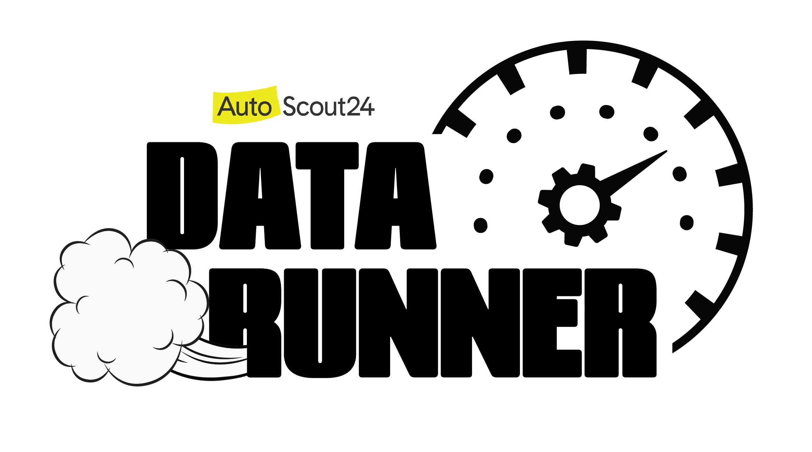

# DataRunner Project template


## **What is DataRunner?**
DataRunner is a tool developed in-house to reduce complexity when creating pipelines and datasets that contain all relevant metadata and quality checks. DataRunner pushes metadata automatically to DataHub for improved discoverability of all data. It also enforces policies as code for improved data governance. [For more information about the tool please check our confluence page](https://autoscout24.atlassian.net/wiki/spaces/DATAPLATFORM/pages/104824833/Product+DataRunner+-+Data+Processing)

## **How to start?**
Use this DataRunner template to create a new repository from it. Click on the top right button **$\textcolor{green}{\textsf{Use this template}}$** and select **Create new repository**. Give your repository a new name that should be prefixed with **dr-**
```
dr-<GIT_REPO_NAME>

# Example: dr-data-platform-engineering-fancy-pipelines
```
Once you have completed your implementation, contact the DPE team via Slack channel [#datalake_and_data-services](https://autoscout24.slack.com/archives/C010Z2UCQE8) so they can configure your pipeline in Fizz.

## **How to deploy your code?**
After you created your repo from the template you will find bag.yaml generated inside. You can start adding your code to **src** folder. For more details please follow the instructions in [Step-by-Step Guide to Create a DataRunner Pipeline](https://autoscout24.atlassian.net/wiki/spaces/DATAPLATFORM/pages/104824833/Product+DataRunner+-+Data+Processing#Product%3ADataRunner-DataProcessing-Step-by-StepGuidetoCreateaDataRunnerPipeline)

## **$\textcolor{cyan}{\textsf{Important}}$** 
> When deploying from **$\textcolor{cyan}{\textsf{main}}$**  branch its considered you are deploying to production and your production role will be assumed. If deployed from any **$\textcolor{cyan}{\textsf{other}}$** branch, the deployment will be considered as development so the role that willl be assumed will have limitiations when writing to s3 bucket or database. You can only write to staging bucket or staging database that will be automatically created for your domain. Also in this case your job in Airflow will automatically be scheduled only for one-time execution.

To deploy your code you can use basic Git commands:

- Check which branch are you currently on
  ```
  $ git branch
  ```
- The checked out branch will have a * before the name. If the return designates anything other then main then switch to main
  ```
  $ git checkout main
  ```
- Once on main and ready to pull updates, you can use the following:
  ```
  $ git pull origin main
  ```
- Depending on your setup, you may even be able to run only the following:
  ```
  $ git pull
  ```
- Now that you are all up to date with the remote repo, you can create a feature branch by using the following:
  ```
  $ git checkout -b my-new-feature-branch
  ```
  This command will create a new branch from main as well as check out out that new branch at the same time. Doing a git branch here again will list out the branches in my local repo and place a * before the branch that is checked out.
  ```
    main
  * my-new-feature-branch
  ```
- As you are creating changes in your project (either in main or a feature branch), these are all unseated updates. With each commit there most likely will be additions, and there will also be deletions from time to time. To get a baring of the updates you have made, you can get the status by using the following:
  ```
  $ git status
  ```
  This command will give you a list of all the updated, added and deleted files.

- To add files, you can add them individually or you can add all at once. From the root of the project you can use:
  ```
  $ git add .
  ```
- To commit your code simply do the following:
  ```
  $ git commit -m "<my_commit_message>"
  ```
- To push your code simply do the following:
  ```
  $ git push origin main
  ```
  or 
  ```
  $ git push origin my-new-feature-branch
  ```

## **Now what?**
After pushing, your code will get validated, built and deployed by [Fizz agent](https://data-runner-pipelines.fizz.services.as24.tech/)
After successful deployment you can find your Airflow DAG [here](https://airflow.as24data.aws.as24.tech/home)
